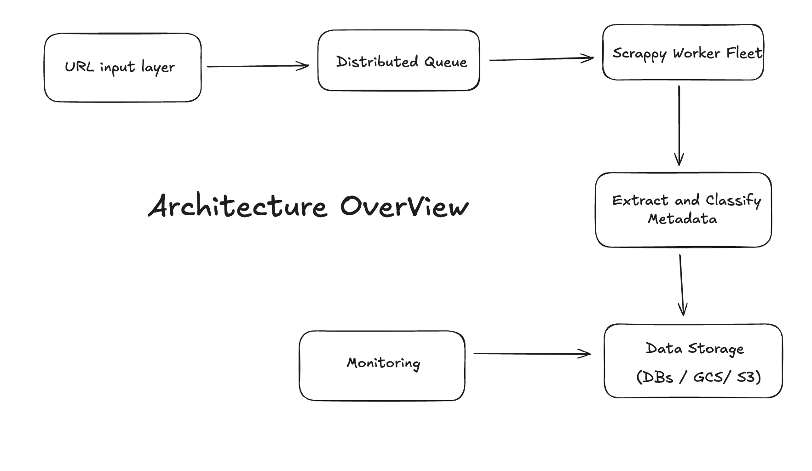

# **Part 2**

## **Objective -**

To build a distributed, polite, and cost-efficient system that:

* Crawls **billions of URLs per month**
* Extracts structured metadata and page content
* Classifies content into high-level topics
* Stores data with a unified schema
* Supports ingestion from **text files** and **MySQL**
* Honors **robots.txt** and domain rate limits

## Architecture Overview -

## Input Layer (URL Sources)

* **MySQL Table** : stores URL + domain + date + status
* **Plaintext File** : fallback for quick loads
* **Kafka or Redis** : for real-time streams (future)

URL ingestion jobs will support filters by:

* Domain (`amazon.com`)
* Timeframe (`2025-07`)
* Priority (e.g., product pages)

## Key Optimizations:

| Feature                         |                      Implementation                      |
| ------------------------------- | :------------------------------------------------------: |
| **Concurrent Crawling**   | Use**Scrapy Cluster**or**Scrapy + Ray/Dask** |
| **Retry Management**      |         Enable retries with exponential backoff         |
| **Domain Politeness**     |        Obey `robots.txt`, rate limit per domain        |
| **Dynamic Throttling**    |                 Enable `AutoThrottle`                 |
| **Distributed Scaling**   |           Deploy workers via Docker/Kubernetes           |
| **Config-Driven Spiders** |      Parameterize everything: headers, URLs, rules      |
| **Deduplication**         |          URL fingerprinting (e.g., SHA256 hash)          |
| **Robust Logging**        |     Structured logs with domain, status, retry count     |

## Output: Unified Metadata Schema

Stored in  PostgreSQL, BigQuery , or S3/Parquet depending on use case.

`{
  "url": "https://example.com/product",
  "title": "...",
  "description": "...",
  "keywords": "...",
  "body": "...",
  "topics": ["ecommerce", "tech"],
  "domain": "example.com",
  "crawl_date": "2025-07-19",
  "status": "success",
  "error_message": null,
  "response_time_ms": 430
}`

## Storage Design

| Layer                 | Tech                  | Purpose                   |
| --------------------- | --------------------- | ------------------------- |
| **Raw Content** | AWS S3 / GCS          | Full HTML archive         |
| **Metadata**    | PostgreSQL / BigQuery | Queryable metadata        |
| **Data Lake**   | Parquet on S3/GCS     | Machine learning training |

## Monitoring & Observability

| Metric                         | Tool          |
| ------------------------------ | ------------- |
| Crawls per second/domain       | Prometheus    |
| HTTP error rate (4xx/5xx)      | Grafana       |
| Domain ban rate                | Sentry / Logs |
| Time per crawl                 | Prometheus    |
| Output volume                  | GCS logs      |
| Latency & retries              | Scrapy stats  |
| Logs (structured + searchable) | Loki / ELK    |

## Robots.txt & Politeness

Scrapy natively supports `robots.txt`

SET

ROBOTSTXT_OBEY = True
DOWNLOAD_DELAY = 1
AUTOTHROTTLE_ENABLED = True
AUTOTHROTTLE_START_DELAY = 0.5
Rate limit per domain
Max concurrency per IP

## SLAs & SLOs

| Metric                | Target (SLO)               |
| --------------------- | -------------------------- |
| Crawl success rate    | ≥ 95%                     |
| Max delay per request | ≤ 3s                      |
| Robots.txt compliance | 100%                       |
| Re-crawl freshness    | ≤ 30 days (product pages) |
| Error retry coverage  | ≥ 98% retried             |

# Part 3 - 🚀  Engineering Plan to Build Web-Scale Metadata Crawler

## OVERVIEW: GOAL OF THE PoC

Build a **distributed crawler system** that:

* Ingests 1M+ URLs (from file/MySQL) for major domains
* Extracts structured metadata and body text
* Stores data in a unified format (PostgreSQL + S3)
* Handles politeness, retries, rate-limits
* Classifies content into topic categories

---

## ENGINEERING MILESTONES

| Milestone                                         | Owner             | Time (est.) | Output                    |
| ------------------------------------------------- | ----------------- | ----------- | ------------------------- |
| 1. Finalize data schema                           | Data Eng          | 0.5 day     | Schema v1 (JSON + SQL)    |
| 2. Refactor Scrapy Spider (Modular, Configurable) | Backend Eng       | 2 days      | `script.py` MVP         |
| 3. URL ingestion module (MySQL + file)            | Backend Eng       | 1 day       | `url_loader.py`         |
| 4. Topic classifier baseline (keywords)           | ML Eng            | 0.5 day     | `classify_topics()`     |
| 5. Unified storage: PostgreSQL + S3               | DevOps + Data Eng | 2 days      | Tables, S3 bucket setup   |
| 6. CLI entrypoint (batch run, env config)         | Backend           | 1 day       | `run_scraper.py`        |
| 7. Monitoring stub (logging + stats)              | DevOps            | 1 day       | Logs + CSV stats output   |
| 8. Crawl 100K+ URLs from top domains              | Team              | 1 day       | Output files + dashboards |
| 9. PoC Evaluation: Accuracy, Latency              | Product + Eng     | 0.5 day     | Evaluation report         |
| 10. Code review, clean docs, wrap-up              | All               | 1 day       | Final PoC release         |

Total Time Estimate (PoC): **~10 working days**

## POTENTIAL BLOCKERS

| Blocker                                    | Category     | Mitigation                                          |
| ------------------------------------------ | ------------ | --------------------------------------------------- |
| IP bans / rate limits from domains         | External     | Rotate IPs, delay, obey robots.txt                  |
| Unstructured / inconsistent pages          | Data Quality | Use fallback selectors, structured extraction       |
| Robots.txt restrictions                    | Compliance   | Implement per-domain config, skip disallowed        |
| Topic classifier weak accuracy             | ML Baseline  | Use basic keyword logic first; plug in ML later     |
| Volume/storage scaling                     | Infra        | Start with S3/Postgres, scale to GCS/BigQuery later |
| Crawling very large domains (e.g., Amazon) | Performance  | Use domain-partitioned queues                       |

## KNOWN / TRIVIAL TASKS

| Task                           | Complexity | Notes                                  |
| ------------------------------ | ---------- | -------------------------------------- |
| Metadata extraction via Scrapy | ✅ Trivial | Already implemented                    |
| Robots.txt handling            | ✅ Trivial | Built-in to Scrapy                     |
| Body text cleaning             | ✅ Trivial | `re`,`w3lib`, or `BeautifulSoup` |
| Configurable spider CLI        | ✅ Trivial | Use `argparse`or YAML                |
| JSON/CSV export                | ✅ Trivial | Use `FEEDS` in Scrapy                |

## EVALUATION CRITERIA (Proof of Concept)

| Metric                          | Target Goal                               |
| ------------------------------- | ----------------------------------------- |
| ✅ Metadata extraction coverage | ≥ 95% pages have title + description     |
| ✅ Topic classification         | ≥ 80% match expected category            |
| ✅ Latency per page             | ≤ 3 seconds/page avg                     |
| ✅ Robots.txt compliance        | 100%                                      |
| ✅ Error rate (non-4xx)         | ≤ 5%                                     |
| ✅ Storage format               | Queryable in Postgres + raw in S3         |
| ✅ Observability                | Logs, errors, retry stats                 |
| ✅ Config flexibility           | Accepts domain-level config, supports CLI |

## OWNERSHIP & TEAM DISTRIBUTION

| Role                   | Responsibilities                              |
| ---------------------- | --------------------------------------------- |
| **Backend Eng**  | Spider code, CLI runner, config management    |
| **ML Eng**       | Topic classifier logic (baseline + future ML) |
| **DevOps**       | Infra setup (S3, Postgres, monitoring)        |
| **Data Eng**     | Schema design, data export pipelines          |
| **Product / PM** | Crawl goals, evaluation planning, reporting   |
| **QA / Analyst** | Evaluate sample outputs, check accuracy       |

## RELEASE PLAN

### Phase 0: Code Review & Linting

* Peer review all modules
* Add docstrings and typing

### Phase 1: Dry Run

* Run test crawl with 100–1,000 URLs per domain
* Log failures and evaluate classification

### Phase 2: QA Checkpoint

* Crawl 100k+ URLs from top 3 domains
* Analysts evaluate output for accuracy + schema integrity

### Phase 3: Freeze and Tag

* Lock spider version, schema, configs
* Create reproducible release (`release_v1`) with version control

## TOOLS TO USE

| Category   | Tool                 | Purpose                   |
| ---------- | -------------------- | ------------------------- |
| Crawling   | Scrapy               | Distributed crawling      |
| Scheduling | Airflow              | Batch jobs                |
| Storage    | PostgreSQL, GCS      | Metadata + raw storage    |
| Monitoring | Prometheus + Grafana | Errors, latency, progress |
| Logs       | Sentry               | Debugging                 |
| Packaging  | Docker               | Consistency across runs   |
| Evaluation | Jupyter, Notebooks   | Result validation         |

## DOCUMENTATION REQUIRED

| Owner       | Purpose                                |
| ----------- | -------------------------------------- |
| Data Eng    | Defines metadata schema                |
| Backend Eng | Describes config options for spiders   |
| ML Eng      | How topic classification works         |
| DevOps      | Where data goes and how it's processed |
| Backend Eng | CLI usage, running jobs                |
| Product/QA  | Steps to validate a crawl              |

## HOW TO HAVE A HIGH-QUALITY RELEASE

* Use small domains first for dry runs
* Log every URL with status and retry info
* Enable backpressure with auto-throttle
* Validate samples from every domain manually
* Tag stable version for reproducibility
* Use GitHub Actions / CI to run tests
* Release documentation with sample outputs
